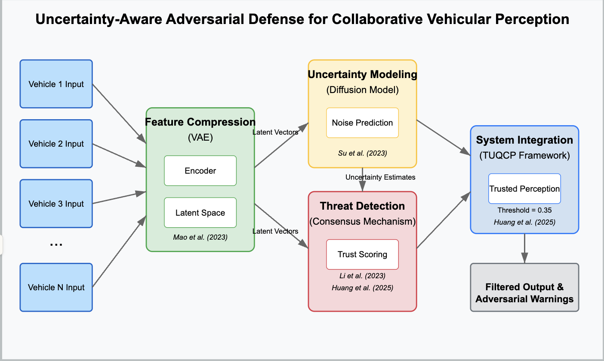
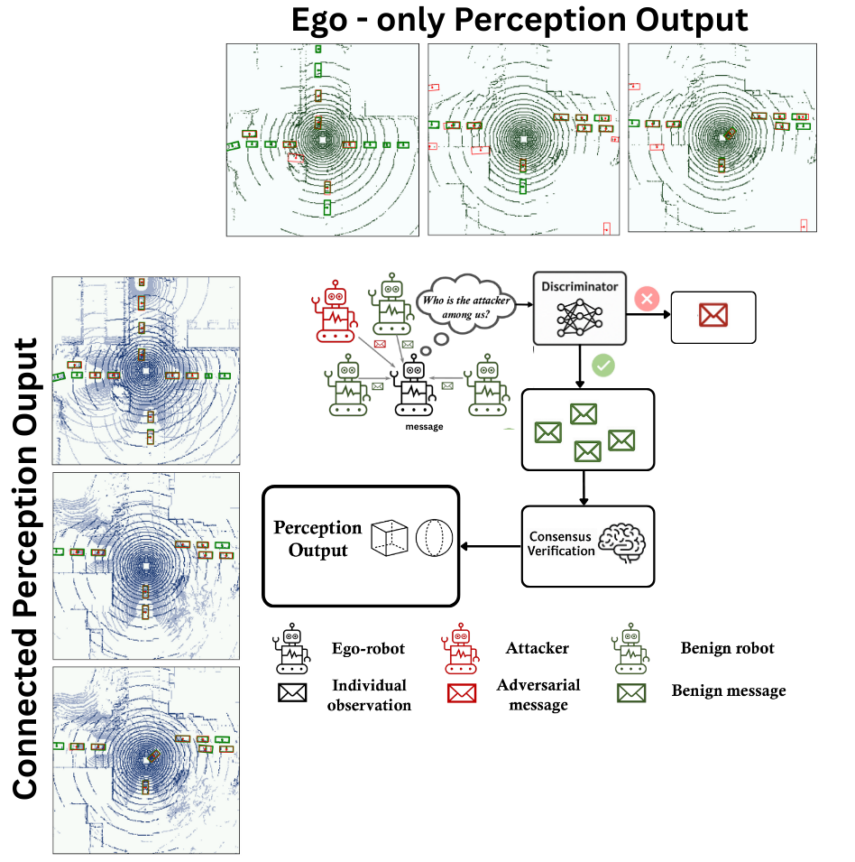

# *JeebNet*: Adversarial Defense in Collaborative Vehicular Perception

**"Simple yet effective sampling mechanism against malicious attackers in multi-agent collaborative perception settings"**
<p align="center"> </p>

<p align="center"> </p>
   

## Introduction

JeebNet (Jasdeep-Ellika-Erik-Bidwat Network) is a research project exploring how to defend multi-agent autonomous driving perception systems against adversarial attacks. In collaborative vehicular perception, connected vehicles and roadside units (V2X) share sensor data (LiDAR, camera feeds, etc.) to expand each individual’s situational awareness. This improves detection of hidden obstacles and extends perception beyond line-of-sight. However, **relying on external sensor inputs makes the system vulnerable** – malicious agents could transmit corrupted or false data to mislead an autonomous vehicle. JeebNet tackles this problem by introducing an **uncertainty-aware threat detection pipeline** that identifies and filters out adversarial inputs, making collaborative perception more robust.

## Our Controntribution File Locations
Here is the folder where most of the code resides [link](./ROBOSAC/coperception/tools/det/)!

In particular we want to note the following files for our latest implementation, train_discrminator.py (file for how we trained our discriminator), find_scenes.py (used to identify which scenes had only 6 agents for our training), robosac.py (original robosac file), run_inference.py (run the robosac system with the discriminator), utils.py. 

Additional files from our first methodology can be found in the three-module-pipeline folder in the projects root. These include CVProject.ipynb which was our first attempt at buliding the system, CV-Project-General-Config.ipynb is the same as CVProject.ipynb but allows you to run it locally by setting config file locations, and encoder-variations contains various attempts at different encoders. 

## Background and Motivation

Individual autonomous vehicles have inherent perception limitations. Onboard sensors have restricted range, blind spots, and performance degradation in poor weather or lighting. Collaborative perception addresses this by enabling vehicles, infrastructure, and pedestrians (V2X) to share sensor information for a richer, more holistic view of the environment. This V2X data exchange lets vehicles “see” around corners or through obstacles and improves safety in complex scenarios. Figure 1 illustrates a multi-vehicle intersection where some cars share data (V2X) and others do not, highlighting the advantage of communication.

Unfortunately, attacks on collaborative perception can be devastating. A malicious vehicle might send adversarially perturbed sensor data or completely fabricated detections to a victim vehicle. This could cause false positives (ghost objects) or mask real obstacles, leading to unsafe decisions. Prior defenses in this domain have drawbacks: some require knowing the attack type in advance or add significant latency. For example, Li et al. (2023) propose a RANSAC-inspired consensus defense (“Among Us”) where vehicles sample random subsets of teammates and only trust the data if enough peers agree​. This method is general to unknown attacks but can be time-consuming due to repeated sampling. Another approach by Su et al. (2023) estimates uncertainty for each collaborative detection​; unreliable inputs (high uncertainty) can then be down-weighted or discarded. Huang et al. (2025) combine adversarial training with uncertainty quantification to make predicted confidence scores more reliable under attack​. These works inspire our solution. JeebNet combines the strengths of learning-based detection and consensus-based validation: it uses a neural network to spot abnormal sensor features (uncertainty awareness and learned discrimination) and a consensus module to ensure robust agreement among agents.

## Dataset Description
For the initial methodology we attempted to use the OPV2V dataset raw images and performed pre-processing on them. Location of one sample dataset: https://drive.google.com/drive/folders/1GRzoCNj69yPzJoLylAR-U1PnKeYOPXuh?usp=sharing. We used a different dataset for our second approach.

Our experiments use the parsed detection dataset of V2X-Sim 2.0​, a public multi-agent autonomous driving dataset simulated in CARLA with SUMO traffic flow. V2X-Sim provides LiDAR point clouds and camera data for multiple vehicles in the same scene, along with 3D bounding box annotations for objects. In our project we focus on 3D object detection in bird’s-eye-view (BEV). The raw point clouds are preprocessed into sparse BEV tensors. During training, one “ego” vehicle combines its own BEV data with that of collaborators to detect cars in the scene. We utilize a subset of ≈2000 frames from V2X-Sim 2.0, split into a training set (~1700 frames across various scenes) and a validation set (~300 frames). Each frame includes up to 6 agents (5 collaborators + 1 ego). Please download and unzip the [parsed detection dataset](https://drive.google.com/file/d/17ADXn0-M2R7Rlg2BvopE_EhXELiBvbwl/view?usp=sharing) of V2X-Sim 2.0.


### Specifying Dataset

Link the test split of V2X-Sim dataset in the default value of argument "**--train_data** and **--test_data**"

```bash
/{Your_location}/V2X-Sim-det/train
/{Your_location}/V2X-Sim-det/test
```

in the `train` and `test` folder data are structured like:

```
train or test
├──agent_0
├──agent_1
├──agent_2
├──agent_3
├──agent_4
├──agent_5
      ├──19_0
	    ├──0.npy		
	    ...
```

## Environment Setup

### Requirements
For initial methodology:
* Google Collab
* Google drive access

For final methodology:
* Linux (tested on Ubuntu 18.04)
* Python 3.7
* Anaconda
* PyTorch
* CUDA 11.7


### Create Anaconda Environment from yml

in the directory of `ROBOSAC`:

```bash
cd coperception
conda env create -f environment.yml
conda activate coperception
```

### CUDA

```bash
conda install pytorch torchvision torchaudio pytorch-cuda=11.7 -c pytorch -c nvidia
```

### Install CoPerception Library

This installs and links `coperception` library to code in `./coperception` directory.

```bash
pip install -e .
```

### Specifying Detection Model Checkpoint

Link the checkpoint location in the default value of argument "**resume**"

Please download [pre-trained weights](https://drive.google.com/drive/folders/1dGEYIzc5ITFKR0TSZfXPYAIw2GBo4oBT?usp=share_link) and save them in `Jeebnet/coperception/ckpt/meanfusion` folder.

`epoch_advtrain_49.pth` is the PGD-trained model.


## Training the model
For the initial methodology we only need to run .ipnb in google collab and the model trains following data loading.

To train the adversarial-defense discriminator, you will need the V2X-Sim dataset path and a pre-trained detection model checkpoint. We assume you have preprocessed data folders for train and test (validation). Update the --train_data and --test_data arguments accordingly

```bash
python train_discriminator.py --train_data "/path/to/V2X-Sim-det/train" \
--test_data "/path/to/V2X-Sim-det/test"
```

This will train JeebNet for 10 epochs on the training set, simulating 1 attacker per frame using PGD with max perturbation $\epsilon=0.5$. The batch size is 1 “scene” (which internally comprises data from up to 6 agents). Training progress (loss per epoch) will be printed to the console. The script will also save model checkpoints (weights) after training. Under the hood, the training script performs the following for each iteration:

- Loads a batch (one time-step from a random scene) of multi-agent data.
- Randomly selects one collaborator as the attacker and applies adversarial noise to its feature map.
- Feeds all feature maps into the discriminator model, which outputs a logit for each agent indicating predicted “attacker-ness”.
- Computes the loss by comparing the discriminator’s output to the true attacker label (the index of the agent we perturbed). We use CrossEntropyLoss treating the attacker index as the target class.
- Backpropagates and updates the model parameters. Only the last layers of ResNet are trainable (others are frozen to retain general feature extraction).
- Moves to the next batch. Every epoch, it evaluates on a validation set (with similarly generated attacks) to monitor performance.

Training for 10 epochs takes around 10 hours on a single GPU (NVIDIA RTX 3060) for our dataset. You can adjust --epochs, or attacker parameters as needed. After training, you should have a discriminator that can identify malicious agents from their feature embeddings.


## Running Inference and Defense Evaluation

After training, use the inference script to evaluate the model’s performance in detecting attacks and maintaining detection accuracy in a collaborative setting.

This will load the saved discriminator from training (epoch 10) and run it on the test/validation set with 1 simulated attacker in each scene. We enable the ROBOSAC consensus method (--robosac robosac_mAP) to robustly handle the attack, and --visualization to generate qualitative output images. Key steps during inference for each frame:

- **Initial detection**: The base collaborative detection model (from CoPerception, e.g., MeanFusion) processes the multi-agent data to produce detection results (bounding boxes for vehicles).
- **Discriminator prediction**: The trained JeebNet discriminator takes the fused feature maps and predicts which agent is most likely malicious. Suppose it outputs agent X as the top suspect.
- **Consensus verification**: The consensus module then evaluates detection results when excluding agent X. It systematically samples subsets of the remaining agents to confirm that including X was causing inconsistencies. If consensus is reached that agent X is the outlier, it is flagged as an attacker and removed from the collaboration for that frame. If the consensus process cannot isolate an attacker (no agreement reached), it falls back to using ego vehicle data only (safe but limited).
- **Output**: The script records whether the attacker was correctly identified and the final object detection outcome. It also computes metrics like the attacker detection accuracy and overall 3D detection performance (e.g., mAP if applicable).

With *--visualization* on, after consensus the code will call our visualization utility to save a BEV image of the scene, marking detections.

During inference, you will see logs printed for each frame or scene. For instance, the script reports the consensus process and whether it succeeded. After running through all frames, it will print summary statistics. In our testing on 300 validation frames with one attacker, the defense successfully achieved consensus in 94.3% of frames – meaning the attacker was correctly identified and filtered out in the vast majority of cases. It will also report the average validation loss of the discriminator and detection accuracy. If *--visualization* is enabled, look for saved images in an output directory for qualitative results.


## Acknowledgment  

*JeebNet* is modified from  [ROBOSAC](https://github.com/coperception/ROBOSAC/tree/main) and [coperception](https://github.com/coperception/coperception) library.

PGD/BIM/CW attacks are implemented from [adversarial-attacks-pytorch](https://github.com/Harry24k/adversarial-attacks-pytorch) library.

This project is not possible without these great codebases.
